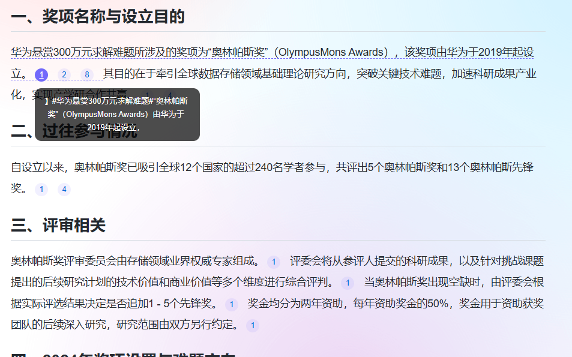
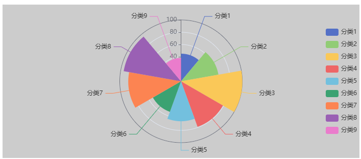

# zx-markdown使用

```angular2html
// import ZxMarkdown from "zx-markdown";
// import "zx-markdown/zx-markdown.css";


<zx-markdown v-model:markdownValue="value" :loading="false"/>

支持字段loading 为true时显示加载中，不渲染echarts图表

```

## 引用

```angular2html
12月2日下午，[[在海南省三亚市海棠区海南环岛旅游公路上发生了一起车祸，导致一名年轻女性机车骑手去世。「[{"index":1,"href":"https://baidu.com","value":"导致一名年轻女性机车骑手去世导"},{"index":1,"href":"https://baidu.com","value":"导致一名年轻女性机车骑手去世导"}]」]] 12月2日下午，[[在海南省三亚市海棠区海南环岛旅游公路上发生了一起车祸，导致一名年轻女性机车骑手去世。「[{"index":1,"href":"https://baidu.com","value":"导致一名年轻女性机车骑手去世"}」]]
```

示例图 

## echarts图表
```

```echarts
{
    "backgroundColor": "#ccc",
    "angleAxis": {
        "type": "category"
    },
    "radiusAxis": {
        "min": 0,
        "max": 100,
        "interval": 20
    },
    "polar": {},
    "tooltip": {
        "confine": true
    },
    "legend": {
        "show": true,
        "right": "0%",
        "top": "center",
        "orient": "vertical",
        "data": [
            "分类1",
            "分类2",
            "分类3",
            "分类4",
            "分类5",
            "分类6",
            "分类7",
            "分类8",
            "分类9"
        ]
    },
    "series": [
        {
            "type": "pie",
            "radius": "80%",
            "center": [
                "50%",
                "50%"
            ],
            "roseType": "area",
            "label": {
                "normal": {
                    "show": true
                },
                "emphasis": {
                    "show": true
                }
            },
            "data": [
                {
                    "value": 45,
                    "name": "分类1"
                },
                {
                    "value": 62,
                    "name": "分类2"
                },
                {
                    "value": 100,
                    "name": "分类3"
                },
                {
                    "value": 79,
                    "name": "分类4"
                },
                {
                    "value": 65,
                    "name": "分类5"
                },
                {
                    "value": 53,
                    "name": "分类6"
                },
                {
                    "value": 86,
                    "name": "分类7"
                },
                {
                    "value": 95,
                    "name": "分类8"
                },
                {
                    "value": 38,
                    "name": "分类9"
                }
            ]
        }
    ]
}

```
示例图 
